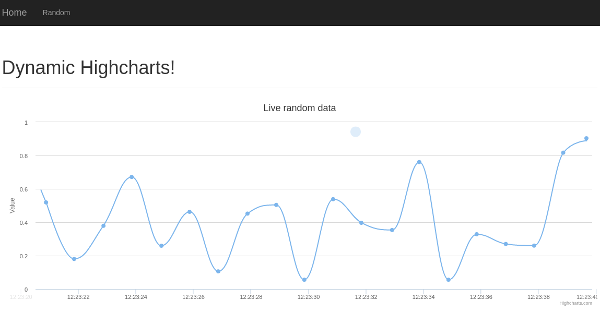
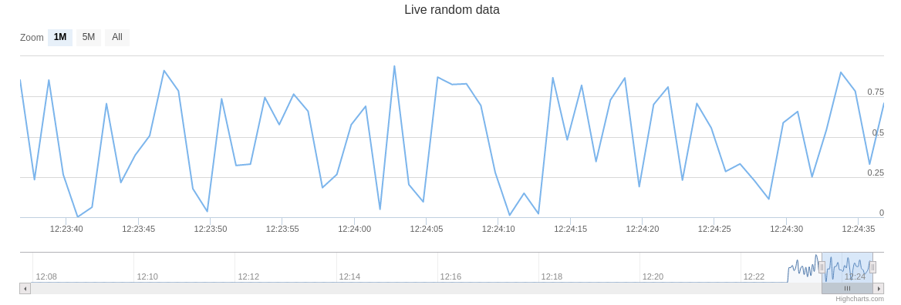

# Highcharts

Dynamic data visualization with Flask, Highcharts. Improved examples in official tutorial by using AJAX to update data. Data updating by querying a database is straightforward under this framework. 

## Screenshot

## Troubleshooting

-   **Uncaught ReferenceError: $ is not defined**

Make sure that `` is put like
    
    
        {{ super() }}
        
    

It is important to put **`{{ super() }}`** before script in order to not overriding the `script` block defined by `bootstrap`.
